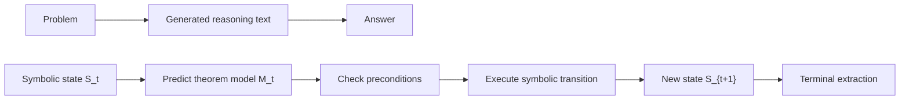

# EGR Related Work Synthesis

Last updated: 2026-07-07

This document translates the initial bibliography into writing decisions for the EGR paper. The goal is not to list related work mechanically, but to use the literature to sharpen EGR's core position:

> Reliable mathematical reasoning should be modeled as state-conditioned prediction and execution of theorem models, not as unconstrained next-token generation.

## 1. Executive Positioning

EGR should be positioned between four research lines:

1. LLM reasoning methods such as CoT, self-consistency, least-to-most prompting, Tree of Thoughts, and reasoning-model RL show that intermediate reasoning matters, but they still operate mainly in text-token or thought-string space.
2. Process supervision and verifier-guided math reasoning show that final-answer supervision is insufficient, but most verifiers evaluate generated text rather than execute domain-specific mathematical transitions.
3. Program/tool/symbolic-solver systems such as PAL, PoT, Logic-LM, LINC, and declarative math solvers show that LLMs should delegate exact computation or deduction to external symbolic mechanisms.
4. Formal theorem proving and geometry systems such as HOList, LeanDojo, AlphaGeometry, AlphaGeometry2, and Inter-GPS show that mathematical reasoning can be organized as state/action search guided by learned models.

EGR's distinctive contribution should be stated as:

> EGR reformulates conic-section problem solving as a sequence of state-conditioned theorem-model transitions. A neural selector predicts the next executable theorem model under the current abstract state; a symbolic applicator checks preconditions and executes the transition over the exact symbolic state; entropy and terminal extraction control continuation and answer grounding.

This is stronger than saying "we combine LLMs and symbolic reasoning". The sharper claim is: EGR changes the reasoning unit from token/thought/program text to theorem-model transition.

## 2. How the Literature Changes the EGR Story

### 2.1 From Chain-of-Thought to Executable Theorem-Model Transition

CoT and its variants establish that intermediate steps help LLM mathematical reasoning. However, the step remains a natural-language fragment generated by next-token prediction. Self-consistency and Tree of Thoughts go further by sampling or searching over multiple reasoning paths, but their intermediate units are still textual thoughts. This gives EGR a clean opening:

> Existing LLM reasoning methods improve the generation of intermediate text; EGR changes the type of intermediate unit. Each step is an executable theorem model with explicit preconditions and a symbolic state update.

Suggested phrasing:

> CoT makes reasoning visible as text, but not executable as mathematics. EGR makes each reasoning step an executable theorem-model transition.

Use citations:

- Chain-of-Thought Prompting: https://arxiv.org/abs/2201.11903
- Self-Consistency: https://arxiv.org/abs/2203.11171
- Tree of Thoughts: https://arxiv.org/abs/2305.10601
- Premise-Augmented Reasoning Chains: https://proceedings.mlr.press/v267/mukherjee25a.html

### 2.2 From Final-Answer Accuracy to Process-Level Reliability

Training Verifiers, Let's Verify Step by Step, Math-Shepherd, and PARC all support the idea that final-answer correctness is an incomplete measure of mathematical reasoning. The EGR paper should explicitly map this literature onto its internal failure taxonomy:

- Selection failure: the solver chooses the wrong theorem model for the current state.
- Applicability failure: the chosen theorem model is mathematically invalid under the current state.
- Execution failure: the theorem model is right, but symbolic transformation is wrong.
- Termination failure: the solver stops too early or continues after the state is sufficient.
- Extraction failure: the final symbolic state is sufficient, but the answer is extracted incorrectly.

This taxonomy lets EGR claim more than accuracy improvement. It claims diagnostic structure.

Suggested phrasing:

> Process-supervision work shows that reliable mathematical reasoning requires feedback beyond final answers. EGR operationalizes this principle by exposing each mathematical decision as a checkable transition: which theorem model is selected, whether its preconditions hold, what symbolic facts are produced, and whether the resulting state is terminal.

Use citations:

- Training Verifiers to Solve Math Word Problems: https://arxiv.org/abs/2110.14168
- Let's Verify Step by Step: https://arxiv.org/abs/2305.20050
- Math-Shepherd: https://arxiv.org/abs/2312.08935
- PARC: https://proceedings.mlr.press/v267/mukherjee25a.html

### 2.3 From Program Execution to Theorem-Model Execution

PAL and PoT are the most useful comparison points for EGR's "predict and execute" idea. They show a successful division of labor: LLMs decompose the problem and external runtimes execute exact computation. But arbitrary programs are a loose interface for mathematical reasoning; they do not necessarily expose theorem choice, precondition satisfaction, domain-specific state, or termination.

EGR's writing should therefore present PAL/PoT as conceptual predecessors but distinguish the mathematical action space:

> PAL and PoT offload computation to executable programs. EGR offloads theorem application itself to executable theorem models.

This is important because it keeps EGR from sounding like another code-generation solver.

Use citations:

- PAL: https://arxiv.org/abs/2211.10435
- Program of Thoughts: https://arxiv.org/abs/2211.12588
- Toolformer: https://arxiv.org/abs/2302.04761
- ReAct: https://arxiv.org/abs/2210.03629
- Declarative symbolic solvers for math word problems: https://arxiv.org/abs/2304.09102

### 2.4 From Semantic Parsing to State-Conditioned Transition

Logic-LM and LINC translate natural-language problems into symbolic logic and let solvers or theorem provers perform deterministic inference. These works are strong evidence for solver-grounded reliability. But many such systems are one-shot or formulation-centered: parse the problem, solve it, return the answer.

EGR should emphasize the dynamic part:

> EGR does not only translate a problem into a formal object; it repeatedly updates a symbolic state through theorem-model actions conditioned on what is currently known.

This distinction is important for conic-section problems, where the next theorem depends on recovered parameters, recognized curve type, existing relations, and query requirements.

Use citations:

- Logic-LM: https://arxiv.org/abs/2305.12295
- LINC: https://arxiv.org/abs/2310.15164
- Intermediate Languages Matter: https://arxiv.org/abs/2509.04083

### 2.5 From Formal Theorem Proving to Domain-Specific Mathematical Problem Solving

HOList, GPT-f, PACT, HyperTree Proof Search, Thor, Draft-Sketch-Prove, and LeanDojo all support the idea that learned models can guide formal proof environments. EGR should borrow the language of "state", "action", "premise/theorem selection", "search", and "environment feedback", but avoid claiming to be a general theorem prover.

The safe and strong comparison:

> Formal theorem proving studies learned guidance in proof assistants. EGR brings the same state/action discipline to a more applied mathematical problem-solving domain: conic-section analytic geometry.

This lets the paper sound rigorous without overclaiming.

Use citations:

- HOList: https://proceedings.mlr.press/v97/bansal19a.html
- GPT-f: https://arxiv.org/abs/2009.03393
- PACT: https://arxiv.org/abs/2102.06203
- HyperTree Proof Search: https://arxiv.org/abs/2205.11491
- Thor: https://arxiv.org/abs/2205.10893
- Draft, Sketch, and Prove: https://arxiv.org/abs/2210.12283
- LeanDojo: https://arxiv.org/abs/2306.15626

### 2.6 Why Conic-Section Problems Are a Strong Testbed

AlphaGeometry and Inter-GPS are the most important references for defending the conic-section setting. They show that geometry is a natural domain for neuro-symbolic mathematical reasoning because it has structured concepts, theorem rules, state-dependent actions, and verifiable intermediate conclusions.

EGR should not describe conic sections as a narrow toy domain. It should frame them as a controlled but nontrivial testbed:

> Conic-section problems combine geometric semantics with algebraic execution. Solving them requires recognizing curve types, recovering parameters from equations, applying relations involving foci, directrices, eccentricity, tangents, asymptotes, or intersections, and simplifying exact symbolic expressions. These steps are state-dependent: a theorem model becomes applicable only after its preconditions have been derived.

This gives EGR a clear domain rationale:

- More structured and theorem-driven than generic arithmetic word problems.
- More executable and evaluable than open-ended proof generation.
- More algebraically demanding than pure diagram geometry.
- Natural for testing selection, execution, termination, and extraction separately.

Use citations:

- AlphaGeometry: https://www.nature.com/articles/s41586-023-06747-5
- AlphaGeometry DeepMind summary: https://deepmind.google/blog/alphageometry-an-olympiad-level-ai-system-for-geometry/
- AlphaGeometry2: https://arxiv.org/abs/2502.03544
- Inter-GPS: https://arxiv.org/abs/2105.04165
- TheoremQA: https://arxiv.org/abs/2305.12524

## 3. Claim-to-Citation Map

### Claim 1: Direct answer generation hides the key mathematical decisions.

Use this claim in the introduction.

- Support from CoT: intermediate reasoning improves performance, which implies direct answer prediction is insufficient.
- Support from MATH: mathematical problem solving remains hard and needs algorithmic advances beyond scaling.
- Support from PARC: linear reasoning chains make dependency verification difficult.

Best citations: CoT, MATH, PARC.

### Claim 2: Final-answer accuracy is not enough to judge reliable mathematical reasoning.

Use this claim in the motivation and evaluation section.

- Training Verifiers shows the usefulness of verification.
- Let's Verify Step by Step shows process supervision can outperform outcome supervision.
- Math-Shepherd shows automatic step-level reward can help verification and RL.

Best citations: Training Verifiers, Let's Verify Step by Step, Math-Shepherd.

### Claim 3: Neural proposal and symbolic execution should be separated.

Use this claim in the method overview.

- PAL and PoT separate LLM decomposition from executable computation.
- Logic-LM and LINC separate natural-language interpretation from symbolic inference.
- AlphaGeometry separates neural prediction of useful constructs from symbolic deduction.

Best citations: PAL, PoT, Logic-LM, LINC, AlphaGeometry.

### Claim 4: Theorem/model selection is a learnable and evaluable reasoning problem.

Use this claim when defining the selector.

- HOList and LeanDojo treat proof/tactic/premise decisions as learnable in proof environments.
- Thor emphasizes premise selection.
- Inter-GPS includes a theorem predictor for geometry theorem sequences.
- TheoremQA shows that theorem application is a distinct challenge for LLMs.

Best citations: LeanDojo, Thor, Inter-GPS, TheoremQA.

### Claim 5: State/action representation is central to neuro-symbolic reasoning.

Use this claim when introducing `SymbolicState`, `AbstractState`, and theorem-model pool.

- Intermediate Languages Matter directly supports the importance of representation choice.
- Closed Loop Neural-Symbolic Learning supports feedback through symbolic modules.
- Scallop supports symbolic representation as a programming interface.
- CLRS supports learning/evaluating executable processes, not only final outputs.

Best citations: Intermediate Languages Matter, Closed Loop NS, Scallop, CLRS.

### Claim 6: Conic-section problems are a meaningful validation domain.

Use this claim in the dataset/problem setting section.

- AlphaGeometry shows geometry as a high-profile neuro-symbolic reasoning domain.
- Inter-GPS shows theorem prediction and symbolic geometry solving are established and valuable.
- TheoremQA shows theorem-driven reasoning is a distinct challenge even for strong LLMs.

Best citations: AlphaGeometry, Inter-GPS, TheoremQA.

## 4. Proposed Related Work Structure

### 4.1 LLM Mathematical Reasoning

Draft paragraph:

> Recent work on LLM mathematical reasoning has shown that intermediate reasoning traces substantially improve performance over direct answer generation. Chain-of-thought prompting, self-consistency, least-to-most prompting, and Tree of Thoughts elicit or search over multi-step textual reasoning paths. However, these methods still represent reasoning steps as unconstrained natural-language tokens or thought strings. This makes it difficult to determine whether a step selects an applicable mathematical principle, executes the required symbolic operation correctly, or reaches a state sufficient for answer extraction. EGR addresses this limitation by replacing free-form reasoning steps with executable theorem-model transitions conditioned on the current problem state.

### 4.2 Process Supervision and Verification

Draft paragraph:

> A second line of work studies verification and process supervision for mathematical reasoning. Verifier-guided decoding, process reward models, and premise-augmented reasoning chains demonstrate that final-answer supervision alone is insufficient for reliable multi-step reasoning. EGR follows this process-oriented view, but grounds each step in a symbolic state transition: the system can inspect which theorem model was selected, whether its preconditions were satisfied, what symbolic facts were produced, and whether the state should terminate.

### 4.3 Tool- and Solver-Augmented LLMs

Draft paragraph:

> Program- and tool-augmented methods such as PAL, Program of Thoughts, Toolformer, ReAct, Logic-LM, and LINC show that LLMs can be made more reliable by delegating computation or deduction to external executable systems. EGR adopts the same division of labor but specializes the interface to mathematical theorem application. Instead of generating arbitrary programs or one-shot logical forms, EGR repeatedly predicts executable theorem models and applies them as symbolic state transitions.

### 4.4 Learning-Guided Theorem Proving and Geometry Solving

Draft paragraph:

> Learning-guided theorem proving systems such as HOList, GPT-f, Thor, LeanDojo, and HyperTree Proof Search formulate proof construction as guided search in formal environments. Geometry solvers such as AlphaGeometry and Inter-GPS further show that neural guidance can effectively steer symbolic deduction in structured geometry domains. EGR is inspired by this state/action view, but targets conic-section problem solving, where the central challenge is not only proof search but also state-dependent theorem selection, algebraic execution, continuation control, and answer extraction.

### 4.5 Neuro-symbolic Reasoning Frameworks

Draft paragraph:

> Broader neuro-symbolic work emphasizes the benefits of separating neural perception or prediction from symbolic reasoning and explicit programmatic representations. EGR contributes a domain-specific instantiation of this principle for conic-section reasoning: an abstract state supports neural theorem-model prediction, while an exact symbolic state supports precondition checking, execution, and terminal answer grounding.

## 5. Figure Plan

### Figure 1: Paradigm Shift

Purpose: Show the central contrast with LLM next-token generation.

Caption idea:

> Unlike next-token reasoning, EGR treats each reasoning step as a state-conditioned theorem-model transition that can be checked, executed, and traced.

### Figure 2: Related-Work Map

Use two axes:

- X-axis: from text-only generation to executable symbolic grounding.
- Y-axis: from final-answer supervision to explicit process/state supervision.

Suggested placement:

- Bottom-left: direct answer generation, standard prompting.
- Upper-left: CoT, self-consistency, Tree of Thoughts, process reward models.
- Bottom-right: one-shot symbolic solvers, PAL/PoT, Logic-LM/LINC.
- Upper-right: AlphaGeometry, Inter-GPS, LeanDojo, EGR.

EGR should appear as "state-conditioned theorem-model transition for conic-section problem solving".

### Figure 3: EGR Step Anatomy

Purpose: Make the theorem-model transition concrete.

Elements:

- `S_t^sym`: exact equations, facts, variables, constraints, query.
- `S_t^abs`: neural feature/state representation.
- Selector: estimates `P(M_t | S_t^abs)`.
- Theorem model: `precondition + apply`.
- Applicator: checks `can_apply`, executes `apply`.
- `S_{t+1}^sym`: updated facts.
- Entropy/progress: `H(S_t) - H(S_{t+1})`.
- Terminal extractor: returns answer only from terminal symbolic state.

Caption idea:

> A theorem model is not a label. It is an executable action with mathematical preconditions and a deterministic symbolic effect.

### Figure 4: Error Taxonomy

Purpose: Support the reliability claim.

Rows:

- Selection error: wrong theorem model.
- Applicability error: theorem selected before preconditions hold.
- Execution error: symbolic transformation wrong.
- Continuation error: stop too early or continue unnecessarily.
- Extraction error: terminal state sufficient but answer extraction wrong.

Columns:

- Hidden in direct LLM generation?
- Observable in EGR trace?
- Evaluatable metric?
- Possible repair signal?

### Figure 5: Comparison Table

Columns:

- Method family.
- Reasoning unit.
- Execution mechanism.
- Explicit state?
- Step-level validity check?
- Termination control?
- Best citation.

Rows:

- CoT / self-consistency.
- Tree of Thoughts.
- PAL / PoT.
- Logic-LM / LINC.
- LeanDojo / theorem proving.
- AlphaGeometry / Inter-GPS.
- EGR.

The key contrast row for EGR:

> Reasoning unit: theorem model. Execution mechanism: symbolic state transition. Explicit state: yes. Validity check: precondition and applicator. Termination control: entropy and terminal extractor.

## 6. Baseline and Metric Implications

The literature suggests the evaluation should not be only final answer accuracy.

Recommended metrics:

- Final Answer Accuracy: comparable with LLM and solver baselines.
- Theorem-Model Selection Accuracy: whether the selected model matches a valid/expected next action.
- Applicability Rate: percentage of selected theorem models whose preconditions hold.
- Symbolic Transition Correctness: whether `apply` produces mathematically valid facts.
- Trajectory Success Rate: whether the full sequence reaches a terminal state.
- Termination Accuracy: whether the system stops exactly when answer extraction is possible.
- Extraction Correctness: whether the final answer is correctly derived from terminal state.
- Information Gain: average `H(S_t) - H(S_{t+1})` for selected actions.
- Failure Attribution: distribution across selection, applicability, execution, termination, extraction.

Baseline families:

- LLM direct answer.
- CoT prompting.
- Self-consistency / verifier-guided CoT.
- PAL / PoT style program execution.
- LLM + symbolic solver when applicable.
- Rule-only theorem search.
- EGR ablations: no symbolic applicator, no entropy, no terminal extractor, no abstract/symbolic state split.

## 7. Wording Boundaries

Keep these boundaries explicit to avoid overclaiming:

- Do not claim EGR is a general theorem prover. Say it is a domain-specific neural-symbolic problem-solving framework for conic-section problems.
- Do not claim `H(S)` is answer correctness probability. Say it estimates residual solving burden or continuation need.
- Do not collapse low entropy, correct answer, and completed reasoning into one concept.
- Do not describe theorem models as text labels. Say they are executable actions with preconditions and symbolic transition functions.
- Do not frame LLMs as replaced. Frame them as structured by EGR: LLM/neural model proposes, symbolic layer executes, terminal extractor grounds.
- Do not present conic sections as merely convenient. Frame them as controlled but nontrivial: structured geometry plus exact algebra plus state-dependent theorem use.

## 8. Immediate Writing Actions for the EGR Paper

1. Replace broad claims such as "LLMs are bad at math" with a sourced version:

   > Although chain-of-thought and process-supervised LLMs improve mathematical reasoning, their intermediate steps remain mostly free-form textual objects whose applicability, symbolic effect, and termination status are difficult to verify.

2. Add a compact slogan in the introduction:

   > From next-token prediction to next-model transition.

3. Define the central reasoning unit early:

   > A theorem model is an executable mathematical action: it specifies when it can be applied and how it transforms the symbolic problem state.

4. Move entropy into the control mechanism rather than the headline contribution:

   > State entropy estimates residual solving burden and helps decide whether the current state should continue through theorem-model transitions or proceed to terminal extraction.

5. Use AlphaGeometry and Inter-GPS to defend the geometry setting, but differentiate EGR:

   > Unlike Euclidean geometry proving systems that predict auxiliary constructions or theorem sequences for diagram geometry, EGR targets conic-section analytic reasoning where theorem selection must be coupled with exact algebraic state updates and answer extraction.

6. Build a related-work map figure before the method details:

   > This helps reviewers see where EGR sits relative to CoT, process supervision, PAL/PoT, Logic-LM/LINC, theorem proving, and geometry solvers.

## 9. Suggested Introduction Skeleton

Paragraph 1: LLMs have advanced mathematical reasoning through CoT, self-consistency, process supervision, and reasoning-model training, but they still generate reasoning as token sequences.

Paragraph 2: Mathematical problem solving requires three decisions that token generation entangles: selecting a mathematical principle, executing the symbolic operation, and deciding when the current state is sufficient for answer extraction.

Paragraph 3: Conic-section problems are a natural testbed because they combine structured geometric concepts, exact algebraic manipulation, and state-dependent theorem use.

Paragraph 4: EGR reformulates conic-section solving as state-conditioned theorem-model prediction and executable symbolic transition.

Paragraph 5: Contributions:

- A next-model reasoning formulation for conic-section problem solving.
- A dual state representation connecting neural selection and symbolic execution.
- An executable theorem-model pool with precondition checking and deterministic state updates.
- Entropy-guided continuation and terminal extraction.
- Process-level evaluation that attributes failures to selection, execution, termination, or extraction.

## 10. Citation Priority for Draft Revision

Use no more than 12 to 16 papers in the first related-work pass. Suggested core set:

1. CoT - for text-chain reasoning.
2. Tree of Thoughts - for search over reasoning units larger than tokens.
3. Training Verifiers - for verifier-guided math reasoning.
4. Let's Verify Step by Step - for process supervision.
5. Math-Shepherd - for automatic process reward.
6. PARC - for premise/dependency-aware step verification.
7. PAL - for neural decomposition plus executable runtime.
8. PoT - for disentangling computation from reasoning.
9. Logic-LM or LINC - for symbolic solver grounding.
10. LeanDojo - for proof-state/premise selection environment.
11. AlphaGeometry - for neuro-symbolic geometry.
12. Inter-GPS - for theorem prediction and symbolic geometry solving.
13. TheoremQA - for theorem-driven reasoning difficulty.
14. Intermediate Languages Matter - for representation/interface design.

The remaining papers can be used selectively for baselines, broader context, or appendix discussion.
